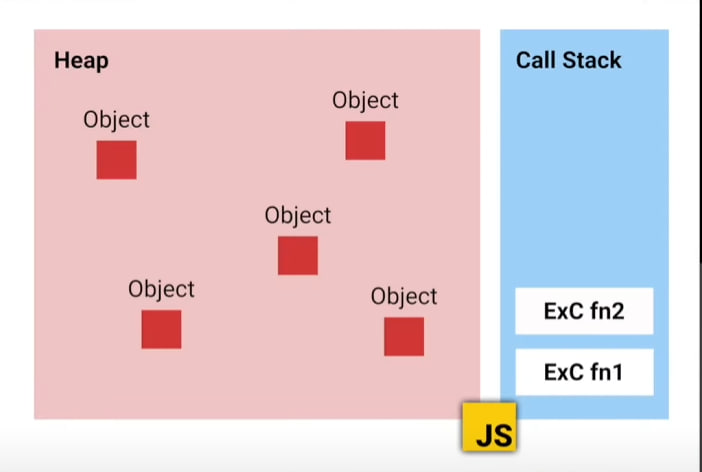
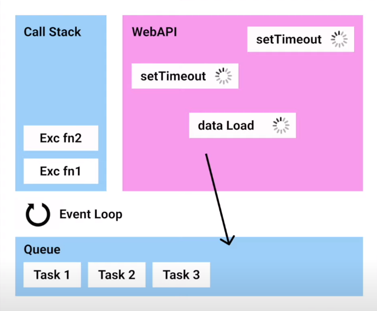
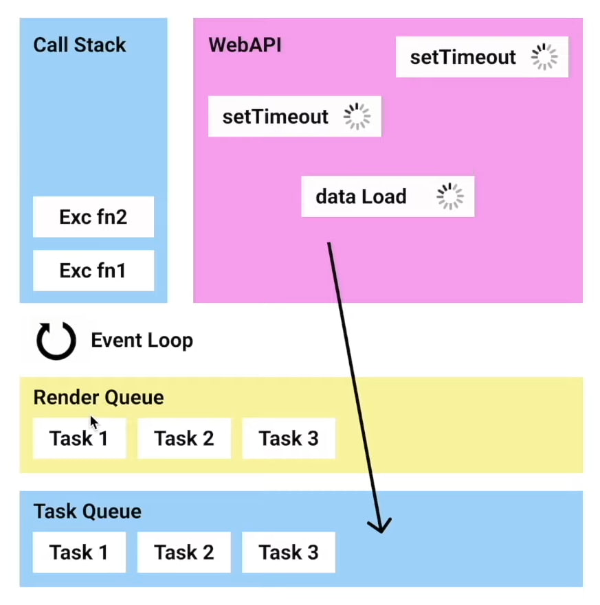

# vue-education

## Event loop

JavaScript - это однопаточный язык программирования , что озночает то , что за одну единицу времени может быть только одно действие

---



### Call Stack

Когда вы вызываете функцию в JavaScript, она добавляется в верхушку стека вызовов. Когда функция завершает свою работу (возвращает значение или просто завершается), она удаляется из вершины стека.

Вы вызываете функцию A.
A добавляется на вершину стека вызовов.
Если функция A вызывает другую функцию B, то B добавляется поверх A в стеке.
Если B в свою очередь вызывает функцию C, то C добавляется поверх B.
Когда C завершает свою работу, она удаляется из вершины стека.
Затем B завершает свою работу и удаляется из стека.
Наконец, когда A завершает свою работу, она тоже удаляется из стека.

Если в стеке вызовов накапливается слишком много функций (например, из-за рекурсии), может возникнуть "Переполнение стека" (Stack Overflow), это когда JavaScript понимает, что стек вызовов стал слишком большой

Стек вызовов важен, потому что он позволяет JavaScript отслеживать, какие функции находятся в процессе выполнения, и в каком порядке они должны быть завершены. Это помогает контролировать поток выполнения вашего кода и предотвращает зацикливание

### Heap

Это часть памяти, где хранятся динамически созданные данные и объекты

В отличие от "стека вызовов" (call stack), который используется для хранения функций и их локальных переменных, "хип" используется для хранения данных, которые вы создаете во время выполнения программы.

Управление хипом осуществляется автоматическим сборщиком мусора (garbage collector) в JavaScript. Сборщик мусора отслеживает, какие объекты больше не используются вашим кодом, и освобождает память, занимаемую ими, чтобы другие объекты могли использовать эту память.

---

## Event loop



Когда javaScript попадает в браузер , у него появляются новые инструменты , они позволяют выполнять различные операции, такие как отправка запросов на сервер, работа с DOM элементами, обработка событий

## WebAPI

Когда вы вызываете функцию из WebAPI в вашем JavaScript коде (например, функцию setTimeout, fetch для отправки запросов на сервер и т. д.), эти вызовы не выполняются непосредственно в стеке вызовов (call stack). Вместо этого они передаются браузеру для выполнения через WebAPI.

Вызывается функция из WebAPI (например, setTimeout).
Этот вызов передается в WebAPI, который выполняет заданное действие (например, устанавливает таймер).
Ваш JavaScript код продолжает выполняться дальше без блокировки.
Когда заданный таймер истекает (или происходит другое событие, например, завершение запроса), браузер добавляет соответствующее событие в очередь событий.
Когда стек вызовов (call stack) пуст (JavaScript закончил выполнение текущего кода), браузер проверяет очередь событий на наличие событий для выполнения.
Если в очереди есть события, браузер достает их и добавляет соответствующую функцию обратного вызова в стек вызовов (call stack) для выполнения.

## Event Queue

Oчередь событий Содержит все события и результаты выполнения асинхронных операций, которые должны быть обработаны вашим JavaScript кодом. Когда стек вызовов (Call Stack) пуст (то есть весь синхронный код выполнен), браузер берет событие или результат из очереди событий и помещает соответствующую функцию обратного вызова (callback) в стек вызовов для выполнения.

## Event Loop

Event Loop (Цикл Событий): - это механизм в JavaScript, который следит за стеком вызовов (Call Stack) и очередью событий (Event Queue), обеспечивая правильный порядок выполнения асинхронного кода.
Он постоянно "просматривает" стек вызовов и проверяет, пуст ли он. Если стек вызовов пуст, то Event Loop берет первое событие из очереди событий и добавляет соответствующую функцию обратного вызова (callback) в стек вызовов для выполнения.
Event Loop позволяет JavaScript быть однопоточным, но при этом обрабатывать асинхронные операции.



## Render Queue

"Render Queue" (очередь рендеринга) - это концепция веб-разработки, которая связана с процессом отрисовки (рендеринга) изменений на веб-странице. В контексте браузера и JavaScript, когда изменяется DOM (Document Object Model) с помощью JavaScript, браузер не всегда немедленно обновляет отображение на экране.

Изменения группируются и применяются пакетами, а не каждое изменение сразу после выполнения JavaScript кода.

Благодаря Render Queue браузер может оптимизировать процесс рендеринга и предотвратить лишнее перерисовывание страницы, делая отображение более плавным и быстрым.

```
// Изменяем стили элемента

document.getElementById('myElement').style.color = 'red';
document.getElementById('myElement').style.fontSize = '20px';

// Эти изменения не применяются сразу, а добавляются в Render Queue

// Другие операции JavaScript

// По завершению блока кода, браузер применит изменения из Render Queue
```
